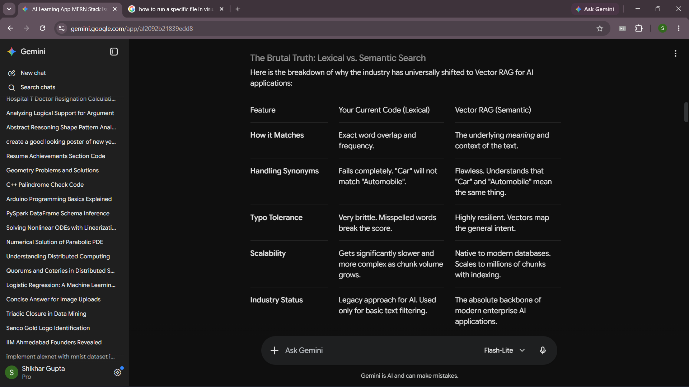
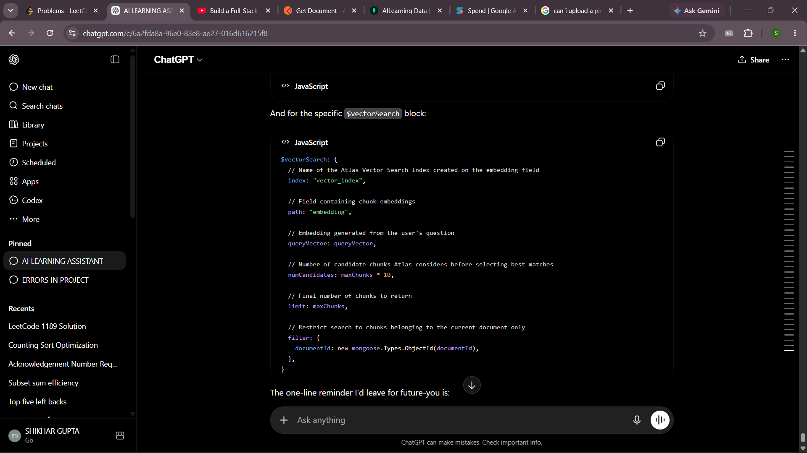

so in utils file there is a file named as pdfParser.js where the main logic of parsing the pdf is written....
parsing is basically

suppose the pdf contains:-

Introduction to Physics

Force = Mass × Acceleration

Energy = mc²

so after parsing it would be

{
text: `
Introduction to Physics

Force = Mass × Acceleration

Energy = mc²
`,
numPages: 12,
info: {...}
}

noww, we pass our file path as a parameter to our extractTextFromPDF function where first it readsFile basically Read the file from disk and load its contents into memory using fs.readFile(filePath).
and PDFParse is the library which basically helps in parsing the text of the pdf and
PDFParse requires a Uint8Array so the file that was basically stored in the disk usinf fs.readFile is first converted into Uint8Array and then passed into PDFParse which parses the text present in the pdf.
after parsing .getText() function is used to get the text from the parsed document and then text, numPages, and info is returned as an object.

RAG:
//vvv IMP
//in uitls...textChunker.js is a very important file because it implements a basic form of Retrieval-Augmented Generation (RAG). First, it splits the extracted PDF text into smaller chunks using chunkText(). Then, when the user asks a question, findRelevantChunks() scores all chunks based on keyword matches with the query and returns the top maxChunks most relevant chunks. These relevant chunks are then sent to the AI model as context, allowing it to generate answers based on the PDF content instead of relying only on its training data.

FLOW:-
PDF
↓
Extract Text
↓
chunkText()
↓
Store Chunks
↓

User Query
↓

findRelevantChunks()
↓

Score each chunk
↓

Top maxChunks
↓

AI Prompt:
Context = Relevant Chunks
Question = User Query
↓

Gemini/OpenAI
↓

Answer

// Vector RAG Retrieval
//
// Every chunk in the Chunk collection stores both:
// 1. The actual chunk text (content)
// 2. Its vector embedding (embedding)
//
// During document processing, embeddings are generated using Gemini's
// embedding model and stored in MongoDB. A Vector Search Index named
// "vector_index" is created on the embedding field in MongoDB Atlas.
//
// When a user asks a question:
//
// Question
//    ↓
// Generate query embedding
//    ↓
// $vectorSearch uses vector_index
//    ↓
// Compare query embedding with stored chunk embeddings
//    ↓
// Find the most semantically similar chunks
//    ↓
// Return top relevant chunks
//
// Unlike keyword search, vector search compares meaning rather than
// exact words. This allows queries like:
//
// "What causes motion?"
//      ↓
// to match a chunk containing
// "Newton's laws explain motion"
//
// even if the exact keywords are different.
//
// The documentId filter ensures that retrieval happens only within
// the currently selected PDF instead of searching across all uploaded
// documents. Finally, only the top maxChunks most relevant chunks
// are returned and later provided to Gemini as context for answer generation.

